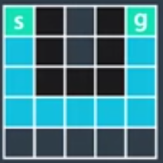
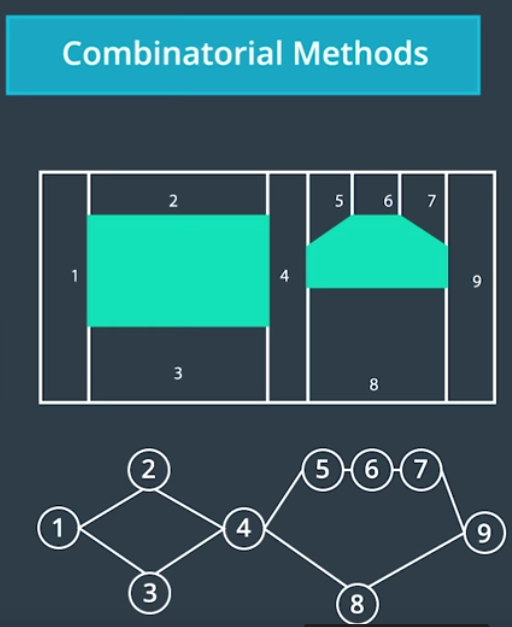
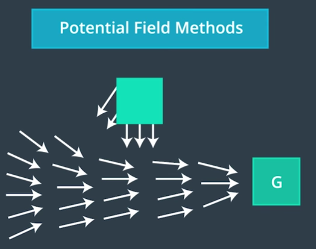

# 1. Introduction
Now, I am  going to where we actually want to find a specific trajectory that the car can take. A trajectory is not just a curve that the car can follow but also a time sequence in which we say how fast the car should go. In finding trajectory, which is smooth and elegant as possible, there are many important things to watch out for:

* The most important one is don't crash
* Don't collide with something else 
* And also important is things like passenger comfort

In this lesson, I'm going to teach you about continuous trajectory planning and more specifically, how to generate drivable trajectories. A quick overview of the lesson:

* First, we will define what the motion planning problem is and discuss a few important concepts and priorities regarding motion planning algorithms.

* Then we'll do a quick review of A* to get you ready for the first new algorithm we will cover which is called Hybrid A* (As name suggests, Hybrid A* isn't purely discrete or continues).

* Next, we explore sampling based method called polynomial trajectory generation, which is really useful for highway driving.

# 2. The Motion Planning Problem

In this [repository](https://github.com/A2Amir/Search-Algorithms-A-Star-and-Dynamic-Prgramming) ,  you saw some best planning algorithms (Dynamic Programming, Optimal Policy, A* ), which solve the motion planning problem but we never formally defined that problem. I'd like to do that now.

Now, there is a word that you might encounter quite a bit if you start reading material regarding motion planning algorithm. That word is "configuration space," which defines all the possible configurations of a robot in the given world.

Consider the maze below where these worlds were all 2D grids, the robot configuration was sometimes two dimensional when we presented it as a x and y point and sometimes three dimensional when also including the robot's heading (x, y, heading). In fact, the configuration space for vehicle that can become even larger depending on what motion planning algorithms we decide to use. 

  
 

With this idea of configuration space in mind, we can define a motion planning problem as follows. We're given three things:

* An initial configuration (q  start)
* A goal configuration(q  goal)
* Some constraints describing how the vehicle was allowed to move, its dynamics and the description of the environment.

Usually, the start configuration is the current configuration of the car given to us by [the localization](https://github.com/A2Amir/Markov-Localization-and-the-Kidnapped-Vehicle-) value and the sensors that give us information about car location, speed, acceleration they can go.

The behavior layer gives us a desired end configuration(q  goal) and maybe some constraints regarding where to go and at which speed.

Finally, the prediction completes this problem by giving us information about how the obstacle region will evolve in time.

**The motion planning problem can then be defined as final sequence of feasible movements in
the configuration space that's moved the robot from a start configuration to an end configuration without hitting any obstacles**.

## 2.1 Properties of Motion Planning Algorithms
When discussing planning algorithms, there are two important properties that we like to talk about.

The first one is called **completeness**. This means that if a solution exists through the multiplying problem, the planner will find it and if a solution does not exist, the planner will terminate and report that no solution exists.

Consider the following two situations. In the first one, the complete algorithm might correctly identify this as a solution and the second one, the algorithm would terminates and tell us there is no solution.

  
 

Now, there may be something bothering you about the solution identified in the first example, which brings us to the second property, **optimality**. A planning algorithm is optimal if it always return the sequence, which minimizes some cost function. If we're using total distance traveled as a cost function for example, then the following situation would be an optimal solution for the first one.

  
 

## 2.2 Types of Motion Planning Algorithms
There are many classes of motion planning algorithms and today we'll focus on one of these classes, but it's worth mentioning the others.

1.**Combinatorial methods** usually consists in dividing the free space into small pieces and first solving
the motion planning problem by connecting the atomic elements. They are very intuitive ways to find initial approximate solution, but they usually do not scale well for large environments.

  
 

2.Next, **potential fields** are reacting methods. Each obstacle is going to create a sort of anti-gravity field, which makes it harder for the vehicle to come close to it. For example, you could imagine using this idea around pedestrians or bikes to encourage your planning algorithm to find trajectories that stay away from them. The main problem with most potential field methods is that they sometimes push us into local minima, which can prevent us from finding a solution.

  
 

3.**Optimal control** consists in trying to solve the motion planning problem and the controlling input generation in one algorithm using a dynamic model of a vehicle or start configuration and end configuration. We want to generate a sequence of inputs, for example, steering angle and throttle inputs, that would lead us from start to end configuration while optimizing a cost function relative to the control inputs such as minimizing gas consumption and relative to the configuration of the car, such as staying at a distance from other vehicles.

There are a lot of very nice ways to do that. Most of them based on numerical optimization methods.However, it is hard to incorporate all of the constraints related to the other vehicles in a good enough way in order for these algorithms to work fast.

4.Finally, there are **sampling based methods**,which are what we will focus on today.These algorithms are very popular because they require a somewhat easier to compute definition of the free space. Sampling based methods use a collision detection module that probes the free space to see if a configuration is in collision or not.

Unlike combinatorial or optimal control methods, which analyzes the whole environment, not all parts of the free space need to be explored in order to find a solution. Explored parts are stored in a graph structure that can be searched with a graph search algorithm like Dijkstra or A star.

  
 

Two main classes of methods can be identified as sampling based:  

* Discrete methods, which rely on a finite set of configurations and/or inputs, like a grid superposed on top of our configuration space.

* Probabilistic methods, which rely on the probabilistic sample of a continuous configuration space. The set of possible configurations or states that will be explored is potentially infinite, which gives some of these methods the nice property that they are probabilistically complete and sometimes probabilistically optimal meaning that they will always find a solution if you allow them enough computation time.

We have scratched the surface on all the different sorts of planning algorithms that exist.

Next, I'm going to present the Hybrid A* algorithm but before that, I suggest you re-read this [repository](https://github.com/A2Amir/Search-Algorithms-A-Star-and-Dynamic-Prgramming) that you learned earlier on A*. 

# 3. The Hybrid A* algorithm

All true statements about [A*](https://github.com/A2Amir/Search-Algorithms-A-Star-and-Dynamic-Prgramming) are:
* It uses a discrete search space
* It uses an optimistic heuristic function to guide grid cell expansion.
* It always finds a solution if one exists (Completeness).
* Solutions it finds are not drivable (it depends on the search space that is being used and what it represents. If the search space represent only the position x,y and we're trying to move a car, there is no guarantees that the sequence of position returned by A* will be drivable but We can define a more complex search space including heading).
* Solutions it finds are always optimal assuming an admissible heuristic.

The fundamental problem here is A* is discrete whereas the robotic world is continuous so the question arises, is there version of A* that can deal with the continuous nature and give us probably executable paths? 

The key to solving this with A* has to do with a state transition function.Suppose we are in a cell like below and you play a sequence of very small steps simulations using our continuous math from before, then a state at the point A might find itself right in the corner (B) of the next discrete state. 

Instead of assigning just the next discrete state to the grid cell, an algorithm called Hybrid A* memorizes the exact X prime Y prime and theta and associate it with the next discrete state, the first time the grid cell (the next discrete state cell) is expanded.  Then when expanding from the next discrete state it uses a specific starting point (B) to figure out what the next cell might be.

  
 

Like below, it might happen that the same cell used to get in A* maybe from C going into a different continuous polymerization of X, Y and theta (D), because in A* we tend to expand cells along the shortest path before we look the longer paths, we not just cut this(C to D) off and never consider again. This leads to a lack of completeness, which means there might be solutions to the navigation problem that this algorithm doesn't capture. It does give us correctness so as long as our motion equations are correct, the resulting paths can be executed. 

  
 

Now, here is a caveat, every time we expand the grid cell, we memorize explicitly the continuous values of X prime, Y prime and theta with the grid cell. 

All true statements about Hybrid A* are:

* It uses a continuous search space
* It uses an optimistic heuristic function to guide grid cell expansion.
* It does not always find a solution if one exists.
* Solutions it finds are drivable.
* Solutions it finds are not always optimal.

## 3.1 Hybrid A* in Practice

In the image above about Hybrid A*, the update equations that we used were somewhat generic to most X Y field configuration spaces. In particular, we don't specify what Omega (w) is. Omega is the heading rate of change (that would mean that the robot can turn around its Z axis without constraints). Now for some robots, it might be that we can specify any omega independently of its state. For car though, this is not very realistic and we should probably use the bicycle model.

  
 

The bicycle model gives us an equation for Omega like below. Here, 'L' is the distance between the front and rear axle , 'δ' is the steering angle and ⱴ is the constant positive velocity. 

  
 

Now, for our Hybrid A* algorithm, we need to decide which configuration can be reached from the current node considered, in order to add them to the open set. In practice, we would probably use some number of steering angles between maximum left steer and maximum right steer angle but the more different Deltas you add the longer it takes for your algorithm to complete.

Therefore, in this example, we will only choose three angles to pick delta from:

* The maximum left steering angle.
* Zero steering angle.
* The maximum right steering angle.

In the case of a car that can turn its wheels 35 degrees at most, that would be -35, 0 and 35.This allows us to expand the search tree with three new motion primitives
* go straight
* steer left 
* steer right.

Before seeing below how that works in a robot maze i should mention:

* I will use gray color to indicate adding a cell to open list.
* We would generate three trajectories, the one for going straight, the one for turning right, the one for turning left. In this case, we can discard the trajectories that go off the map or collide.
* Closed cell is indicated with the green check-mark.
* In all these steps, I'm keeping track of not just what cell I am in but also where in that cell I am, including orientation.

  
 

Sometimes, the algorithm fails to find the solution when one actually exists and Hybrid A* will not find any. We can reduce the likelihood of this problem by increasing the resolution of our grid or adding a third dimension to the search space for the heading. Indeed, this would allow us not to close the position in the map for all headings but only for a specific range, which may allow us to find the solution.

## 3.2 Hybrid A* Heuristics

Hybrid A* is guided by two heuristics, called the non-holonomic-without-obstacles heuristic and the holonomic-with-obstacles heuristic. As the name suggests, the first heuristic ignores obstacles but takes into account the non-holonomic nature of the car. This heuristic, which can be completely pre-computed for the entire 4D space (vehicle location, and orientation, and direction of motion), helps in the end-game by approaching the goal with the desired heading. The second heuristic is a dual of the first in that it ignores the non-holonomic nature of the car, but computes the shortest distance to the goal. It is calculated online by performing dynamic programming in 2-D (ignoring vehicle orientation and motion direction). 

Both heuristics (h1, h2) are admissible and the following combinations are also valid admissible combinations:
* (h1+h2)/2
* max(h1,h2)
* min(h1,h2)

The paper [Junior: The Stanford Entry in the Urban Challenge](https://d17h27t6h515a5.cloudfront.net/topher/2017/July/595fe838_junior-the-stanford-entry-in-the-urban-challenge/junior-the-stanford-entry-in-the-urban-challenge.pdf) is a good read overall, but Section 6.3 - Free Form Navigation is especially good and goes into detail about how the Stanford team thought about heuristics for their Hybrid A* algorithm (which they tended to use in parking lots).

## 3.3 Hybrid A* Pseudocode
The pseudocode below outlines an implementation of the A* search algorithm using the bicycle model. The following variables and objects are used in the code but not defined there:

* State(x, y, theta, g, f): An object which stores x, y coordinates, direction theta, and current g and f values.
* grid: A 2D array of 0s and 1s indicating the area to be searched. 1s correspond to obstacles, and 0s correspond to free space.
* SPEED: The speed of the vehicle used in the bicycle model.
* LENGTH: The length of the vehicle used in the bicycle model.
* NUM_THETA_CELLS: The number of cells a circle is divided into. This is used in keeping track of which States we have visited already.

The bulk of the hybrid A* algorithm is contained within the search function. The expand function takes a state and goal as inputs and returns a list of possible next states for a range of steering angles. This function contains the implementation of the bicycle model and the call to the A* heuristic function.
~~~c++

def expand(state, goal):
    next_states = []
    for delta in range(-35, 40, 5): 
        # Create a trajectory with delta as the steering angle using 
        # the bicycle model:

        # ---Begin bicycle model---
        delta_rad = deg_to_rad(delta)
        omega = SPEED/LENGTH * tan(delta_rad)
        next_x = state.x + SPEED * cos(theta)
        next_y = state.y + SPEED * sin(theta)
        next_theta = normalize(state.theta + omega)
        # ---End bicycle model-----

        next_g = state.g + 1
        next_f = next_g + heuristic(next_x, next_y, goal)

        # Create a new State object with all of the "next" values.
        state = State(next_x, next_y, next_theta, next_g, next_f)
        next_states.append(state)

    return next_states

def search(grid, start, goal):
    # The opened array keeps track of the stack of States objects we are 
    # searching through.
    opened = []
    # 3D array of zeros with dimensions:
    # (NUM_THETA_CELLS, grid x size, grid y size).
    closed = [[[0 for x in range(grid[0])] for y in range(len(grid))] 
        for cell in range(NUM_THETA_CELLS)]
    # 3D array with same dimensions. Will be filled with State() objects 
    # to keep track of the path through the grid. 
    came_from = [[[0 for x in range(grid[0])] for y in range(len(grid))] 
        for cell in range(NUM_THETA_CELLS)]

    # Create new state object to start the search with.
    x = start.x
    y = start.y
    theta = start.theta
    g = 0
    f = heuristic(start.x, start.y, goal)
    state = State(x, y, theta, 0, f)
    opened.append(state)

    # The range from 0 to 2pi has been discretized into NUM_THETA_CELLS cells. 
    # Here, theta_to_stack_number returns the cell that theta belongs to. 
    # Smaller thetas (close to 0 when normalized  into the range from 0 to 
    # 2pi) have lower stack numbers, and larger thetas (close to 2pi when 
    # normalized) have larger stack numbers.
    stack_num = theta_to_stack_number(state.theta)
    closed[stack_num][index(state.x)][index(state.y)] = 1

    # Store our starting state. For other states, we will store the previous 
    # state in the path, but the starting state has no previous.
    came_from[stack_num][index(state.x)][index(state.y)] = state

    # While there are still states to explore:
    while opened:
        # Sort the states by f-value and start search using the state with the 
        # lowest f-value. This is crucial to the A* algorithm; the f-value 
        # improves search efficiency by indicating where to look first.
        opened.sort(key=lambda state:state.f)
        current = opened.pop(0)

        # Check if the x and y coordinates are in the same grid cell 
        # as the goal. (Note: The idx function returns the grid index for 
        # a given coordinate.)
        if (idx(current.x) == goal[0]) and (idx(current.y) == goal.y):
            # If so, the trajectory has reached the goal.
            return path

        # Otherwise, expand the current state to get a list of possible 
        # next states.
        next_states = expand(current, goal)
        for next_s in next_states:
            # If we have expanded outside the grid, skip this next_s.
            if next_s is not in the grid:
                continue
            # Otherwise, check that we haven't already visited this cell and that there is not an obstacle in the grid there.
            stack_num = theta_to_stack_number(next_s.theta);
            
            if closed[stack_num][idx(next_s.x)][idx(next_s.y)] == 0 and grid[idx(next_s.x)][idx(next_s.y)] == 0:
            
                    # The state can be added to the opened stack.
                    opened.append(next_s)
                    # The stack_number, idx(next_s.x), idx(next_s.y) tuple has now been visited, so it can be closed.
                    closed[stack_num][idx(next_s.x)][idx(next_s.y)] = 1
                    # The next_s came from the current state, and is recorded.
                    came_from[stack_num][idx(next_s.x)][idx(next_s.y)] = current
~~~

